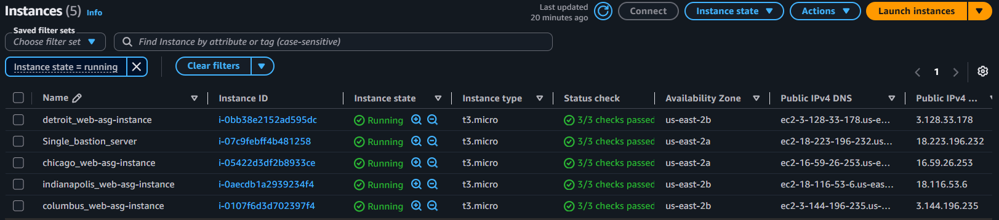
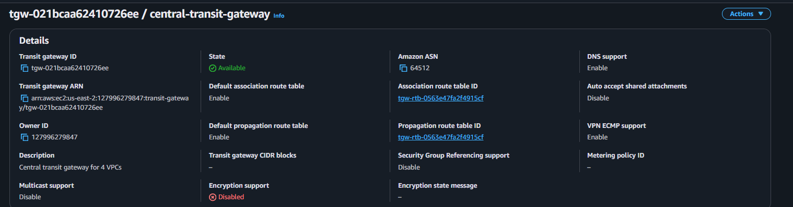
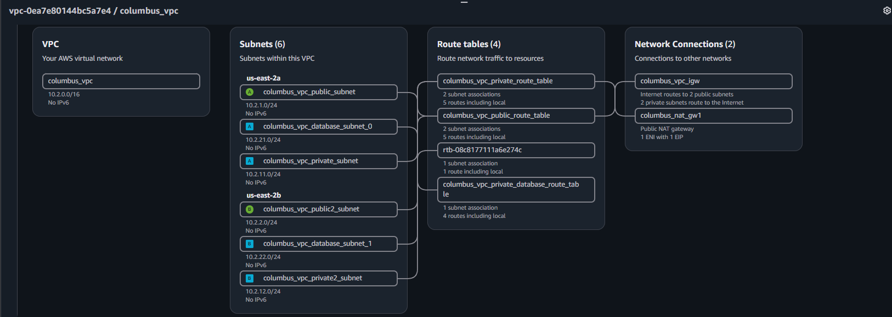
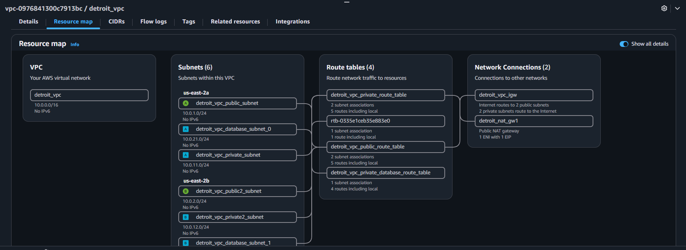
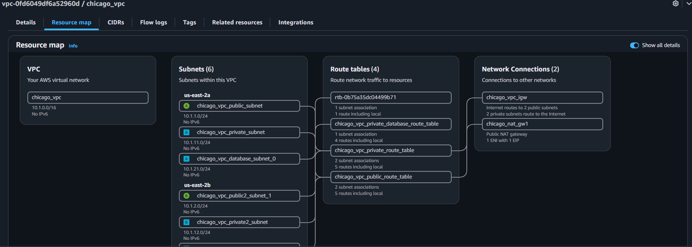
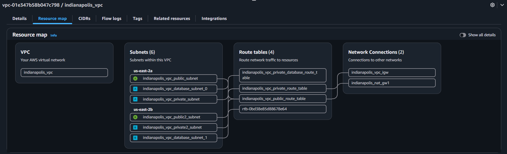
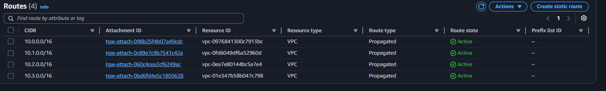
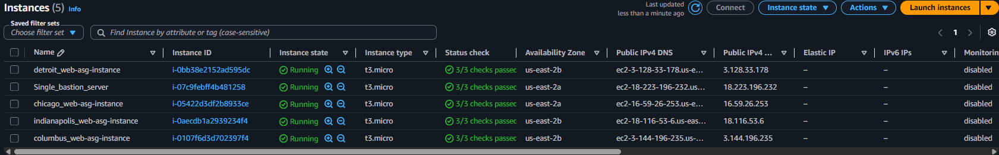
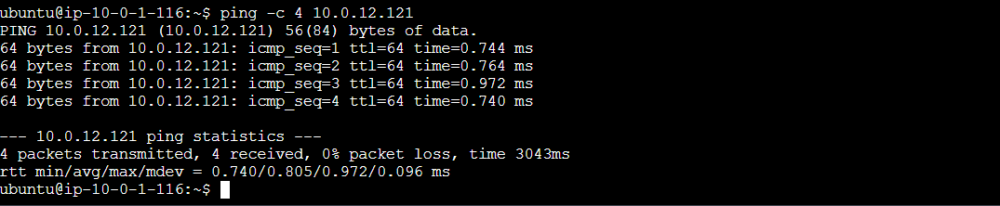

# AWS Transit Gateway with 4 VPCs

[](https://www.terraform.io/)
[](https://aws.amazon.com/)
[]()

Terraform builds a four-VPC AWS network connected through a central Transit Gateway, with a bastion host for access, Auto Scaling Groups with launch templates for the app tier, application load balancers, and MySQL database layers across Detroit, Chicago, Columbus, and Indianapolis.

### Highlights

- Central Transit Gateway linking four VPCs
- Bastion host for controlled SSH access
- Auto Scaling Groups with launch templates for application instances
- Application load balancers for traffic distribution
- Public, private, and database subnet segmentation in each VPC

## Architecture














## Repository Structure

Main Terraform root:

- 4vpc-peering-terraform/env/dev

Key module groups:

- 1detroit_vpc, 2chicago_vpc, 3columbus_vpc, 4indianapolis_vpc
- 5internet_gateway
- 6route_table
- 7nacl
- 8security_group
- 9instance (bastion)
- 9app_asg (application instances)
- 10database
- 11app-alb
- 11transit_gateway

## Network Plan

- Detroit VPC: 10.0.0.0/16
- Chicago VPC: 10.1.0.0/16
- Columbus VPC: 10.2.0.0/16
- Indianapolis VPC: 10.3.0.0/16

Each VPC contains:

- Public subnets (2 AZs)
- Private app subnets (2 AZs)
- Database subnets (2 AZs)

## Prerequisites

- AWS account and IAM permissions for EC2, VPC, TGW, ELB, Auto Scaling, RDS
- Terraform 1.5+
- AWS CLI configured
- SSH key pair files in:
	- 4vpc-peering-terraform/env/dev/keypair.pub
	- 4vpc-peering-terraform/env/dev/keypair.pem

## Deployment

### 1) Go to environment folder

```bash
cd /workspaces/AWS-TRANSIT-GATEWAY-4VPC/4vpc-peering-terraform/env/dev
```

### 2) Initialize Terraform

```bash
terraform init
```

### 3) Validate and review plan

```bash
terraform validate
terraform plan
```

### 4) Apply

```bash
terraform apply -auto-approve
```

## Access and Connectivity Validation

### 1) Get bastion public IP

```bash
aws ec2 describe-instances \
	--region us-east-2 \
	--filters Name=tag:Name,Values=Single_bastion_server Name=instance-state-name,Values=running \
	--query "Reservations[].Instances[].PublicIpAddress" \
	--output text
```

### 2) SSH into bastion

```bash
ssh -i /workspaces/AWS-TRANSIT-GATEWAY-4VPC/4vpc-peering-terraform/env/dev/keypair.pem ubuntu@<bastion-public-ip>
```

### 3) Test private connectivity from bastion

```bash
nc -zv 10.0.12.121 22
nc -zv 10.1.11.119 22
nc -zv 10.2.12.22 22
nc -zv 10.3.12.198 22
```

Expected result: succeeded for all targets.

## Verified Outcome

Bastion host connectivity to all four VPC application instances over private IP and TCP/22 was validated successfully.



## Common Troubleshooting

### SSH fails to bastion

Check:

- Security group inbound TCP/22 from your source IP
- Public subnet route table has 0.0.0.0/0 to Internet Gateway
- Public subnet NACL allows inbound 22 and ephemeral return traffic
- Correct username for Ubuntu AMI: ubuntu
- Correct private key file and permissions

### Bastion cannot reach app instances

Check:

- Bastion security group outbound rules
- Target instance security group inbound TCP/22 from internal CIDR or bastion SG
- TGW routes in each VPC route table
- NACL rules for both source and destination subnets

## Cleanup

```bash
cd /workspaces/AWS-TRANSIT-GATEWAY-4VPC/4vpc-peering-terraform/env/dev
terraform destroy -auto-approve
```

## Notes

- This project currently uses a dev-oriented setup and broad CIDR allowances in some places for easier testing.
- For production, tighten ingress/egress, restrict SSH exposure, and enforce least-privilege IAM and network policy.